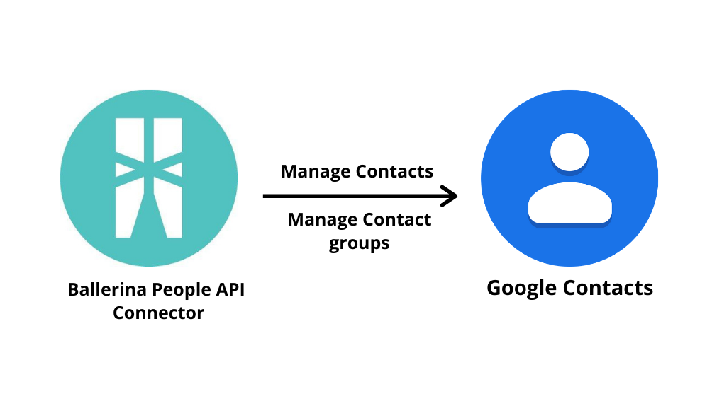

[](https://github.com/ballerina-platform/module-ballerinax-googleapis.people/actions?query=workflow%3ACI)
[](https://github.com/ballerina-platform/module-ballerinax-googleapis.people/commits/master)
[](https://opensource.org/licenses/Apache-2.0)

# Ballerina Google People Connector 
Connects to Google People using Ballerina.

# Introduction
## Google People
[Google People](https://developers.google.com/people) is a contact-management service developed by Google. It lets users to organize their schedule and share events with others. The Google People endpoint allows you to access the Google People API Version v1 through Ballerina.

## Key Features of Google People
* Manage Contacts
* Manage Contact Groups

## Connector Overview

The Google People Ballerina Connector allows you to access the Google People API Version V1 through Ballerina. The connector can be used to implement some of the most common use cases of Google People. The connector provides the capability to programmatically manage contacts and contact groups, CRUD operations on contacts and contact groups operations through the connector endpoints.



# Prerequisites

* Java 11 Installed
  Java Development Kit (JDK) with version 11 is required.

* Download the Ballerina [distribution](https://ballerinalang.org/downloads/) SLAlpha5
  Ballerina Swan Lake Alpha Version 5 is required.

* Instantiate the connector by giving authentication details in the HTTP client config. The HTTP client config has built-in support for BasicAuth and OAuth 2.0. Google People uses OAuth 2.0 to authenticate and authorize requests. 
  * The Google People connector can be minimally instantiated in the HTTP client config using client ID, client secret, and refresh token.
    * Client ID
    * Client Secret
    * Refresh Token
    * Refresh URL

## Compatibility

|                             |            Versions             |
|:---------------------------:|:-------------------------------:|
|    Ballerina Language       |       Swan Lake Alpha 5         |
|     Google People API       |               V1                |


Instantiate the connector by giving authentication details in the HTTP client config. The HTTP client config has built-in support for OAuth 2.0. Google People uses OAuth 2.0 to authenticate and authorize requests. The Google People connector can be minimally instantiated in the HTTP client config using client ID, client secret, and refresh token.

**Obtaining Tokens to Run the Sample**

1. Visit [Google API Console](https://console.developers.google.com), click **Create Project**, and follow the wizard to create a new project.
2. Go to **Credentials -> OAuth consent screen**, enter a product name to be shown to users, and click **Save**.
3. On the **Credentials** tab, click **Create credentials** and select **OAuth client ID**. 
4. Select an application type, enter a name for the application, and specify a redirect URI (enter https://developers.google.com/oauthplayground if you want to use 
[OAuth 2.0 playground](https://developers.google.com/oauthplayground) to receive the authorization code and obtain the refresh token). 
5. Click **Create**. Your client ID and client secret appear. 
6. In a separate browser window or tab, visit [OAuth 2.0 playground](https://developers.google.com/oauthplayground), select the required Google People API scopes, and then click **Authorize APIs**.
7. When you receive your authorization code, click **Exchange authorization code for tokens** to obtain the refresh token. 

**Add project configurations file**

Add the project configuration file by creating a `Config.toml` file under the root path of the project structure.
This file should have following configurations. Add the tokens obtained in the previous step to the `Config.toml` file.

#### For client operations
```
[ballerinax.googleapis.people]
clientId = "<client_id">
clientSecret = "<client_secret>"
refreshToken = "<refresh_token>"
refreshUrl = "<refresh_URL>"

```
# **Samples**

### Create a Contact
```ballerina
import ballerinax/googleapis.people as contacts;
import ballerina/log;

configurable string refreshToken = ?;
configurable string clientId = ?;
configurable string clientSecret = ?;

contacts:GoogleContactsConfiguration googleContactConfig = {
    oauth2Config: {
        clientId: clientId,
        clientSecret: clientSecret,
        refreshUrl: contacts:REFRESH_URL,
        refreshToken: refreshToken
    }
};

contacts:Client googleContactClient = checkpanic new (googleContactConfig);

public function main() {
    // Create Person/Contact with given name
    contacts:Person person = {
        "emailAddresses": [],
        "names": [{
            "familyName": "Hardy",
            "givenName": "Jason",
            "unstructuredName": "Jason Hardy"
        }]
    };
    contacts:FieldMask[] personFields = [contacts:NAME, contacts:PHONE_NUMBER, contacts:EMAIL_ADDRESS];
    contacts:PersonResponse|error createContact = googleContactClient->createContact(person, personFields);
    if (createContact is contacts:PersonResponse) {
        log:printInfo("Person/Contacts Details: " + createContact.toString());
        log:printInfo(createContact.resourceName.toString());
    } else {
        log:printError("Error: " + createContact.toString());
    }
}
```
### Fetch a Contact
```ballerina
import ballerinax/googleapis.people as contacts;
import ballerina/log;

configurable string refreshToken = ?;
configurable string clientId = ?;
configurable string clientSecret = ?;

contacts:GoogleContactsConfiguration googleContactConfig = {
    oauth2Config: {
        clientId: clientId,
        clientSecret: clientSecret,
        refreshUrl: contacts:REFRESH_URL,
        refreshToken: refreshToken
    }
};

contacts:Client googleContactClient = checkpanic new (googleContactConfig);

public function main() {
    string contactResourceName = "";
    contacts:Person person = {
        "emailAddresses": [],
        "names": [{
            "familyName": "Hardy",
            "givenName": "Jason",
            "unstructuredName": "Jason Hardy"
        }]
    };
    contacts:FieldMask[] personFields = [contacts:NAME, contacts:PHONE_NUMBER, contacts:EMAIL_ADDRESS];
    contacts:PersonResponse|error createContact = googleContactClient->createContact(person, personFields);
    if (createContact is contacts:PersonResponse) {
        contactResourceName = <@untainted>createContact.resourceName;
        log:printInfo("Person/Contacts Details: " + createContact.toString());
        log:printInfo(createContact.resourceName.toString());
    } else {
        log:printError("Error: " + createContact.toString());
    }

    // Fetch information about Person/Contact
    contacts:FieldMask[] getPersonFields = [NAME, PHONE_NUMBER, EMAIL_ADDRESS];
    contacts:PersonResponse|error getResponse = googleContactClient->getPeople(contactResourceName, getPersonFields);
    if (getResponse is contacts:PersonResponse) {
        log:printInfo("Person/Contacts Details: " + getResponse.toString());
        log:printInfo(getResponse.resourceName.toString());
    } else {
        log:printError("Error: " + getResponse.toString());
    }
}
```
### Search a Contact using a string value
```ballerina
import ballerinax/googleapis.people as contacts;
import ballerina/log;

configurable string refreshToken = ?;
configurable string clientId = ?;
configurable string clientSecret = ?;

contacts:GoogleContactsConfiguration googleContactConfig = {
    oauth2Config: {
        clientId: clientId,
        clientSecret: clientSecret,
        refreshUrl: contacts:REFRESH_URL,
        refreshToken: refreshToken
    }
};

contacts:Client googleContactClient = checkpanic new (googleContactConfig);

public function main() {
    // Search a Person/Contact with a string
    contacts:FieldMask[] readMasks = [contacts:NAME, contacts:PHONE_NUMBER, contacts:EMAIL_ADDRESS];
    contacts:PersonResponse[]|error response = googleContactClient->searchContacts("Test");
    if (response is contacts:PersonResponse[]) {
        log:printInfo("Person/Contacts Details: " + response.toString());
    } else {
        log:printError("Error: " + response.toString());
    }
}
```

### Delete a Contact
```ballerina
import ballerinax/googleapis.people as contacts;
import ballerina/log;

configurable string refreshToken = ?;
configurable string clientId = ?;
configurable string clientSecret = ?;

contacts:GoogleContactsConfiguration googleContactConfig = {
    oauth2Config: {
        clientId: clientId,
        clientSecret: clientSecret,
        refreshUrl: contacts:REFRESH_URL,
        refreshToken: refreshToken
    }
};

contacts:Client googleContactClient = checkpanic new (googleContactConfig);

public function main() {

    string contactResourceName = "";

    contacts:Person person = {
        "emailAddresses": [],
        "names": [{
            "familyName": "Hardy",
            "givenName": "Jason",
            "unstructuredName": "Jason Hardy"
        }]
    };
    contacts:FieldMask[] personFields = [contacts:NAME, contacts:PHONE_NUMBER, contacts:EMAIL_ADDRESS];
    contacts:PersonResponse|error createContact = googleContactClient->createContact(person, personFields);
    if (createContact is contacts:PersonResponse) {
        contactResourceName = <@untainted>createContact.resourceName;
        log:printInfo("Person/Contacts Details: " + createContact.toString());
        log:printInfo(createContact.resourceName.toString());
    } else {
        log:printError("Error: " + createContact.toString());
    }

    // Delete a contact
    var deleteContact = googleContactClient->deleteContact(contactResourceName);
    if (deleteContact is ()) {
        log:printInfo("Deleted a Contact");
    } else {
        log:printError(deleteContact.toString());
    }
}
```

### Create a Contact Group
```ballerina
import ballerinax/googleapis.people as contacts;
import ballerina/log;

configurable string refreshToken = ?;
configurable string clientId = ?;
configurable string clientSecret = ?;

contacts:GoogleContactsConfiguration googleContactConfig = {
    oauth2Config: {
        clientId: clientId,
        clientSecret: clientSecret,
        refreshUrl: contacts:REFRESH_URL,
        refreshToken: refreshToken
    }
};

contacts:Client googleContactClient = checkpanic new (googleContactConfig);

public function main() {
    // Create Contact Group with given name
    var createContactGroup = googleContactClient->createContactGroup("TestContactGroup");
    if (createContactGroup is contacts:ContactGroup) {
        log:printInfo("Contact Group Details: " + createContactGroup.toString());
        log:printInfo(createContactGroup.resourceName.toString());
    } else {
        log:printError("Error: " + createContactGroup.toString());
    }
}
```
### Fetch a Contact Group
```ballerina
import ballerinax/googleapis.people as contacts;
import ballerina/log;

configurable string refreshToken = ?;
configurable string clientId = ?;
configurable string clientSecret = ?;

contacts:GoogleContactsConfiguration googleContactConfig = {
    oauth2Config: {
        clientId: clientId,
        clientSecret: clientSecret,
        refreshUrl: contacts:REFRESH_URL,
        refreshToken: refreshToken
    }
};

contacts:Client googleContactClient = checkpanic new (googleContactConfig);

public function main() {
    string contactGroupResourceName = "";
    // Create Contact Group with given name
    var createContactGroup = googleContactClient->createContactGroup("TestContactGroup");
    if (createContactGroup is contacts:ContactGroup) {
        log:printInfo("Contact Group Details: " + createContactGroup.toString());
        contactGroupResourceName = createContactGroup.resourceName;
        log:printInfo(createContactGroup.resourceName.toString());
    } else {
        log:printError("Error: " + createContactGroup.toString());
    }

    // Fetch information about Contact Group  
    contacts:ContactGroup|error getResponse = googleContactClient->getContactGroup(contactGroupResourceName, 10);
    if (getResponse is contacts:ContactGroup) {
        log:printInfo("Contact Group Details: " + getResponse.toString());
        log:printInfo(getResponse.resourceName.toString());
    } else {
        log:printError("Error: " + getResponse.toString());
    }
}
```
## Contributing to Ballerina

As an open source project, Ballerina welcomes contributions from the community. 

For more information, go to the [contribution guidelines](https://github.com/ballerina-platform/ballerina-lang/blob/master/CONTRIBUTING.md).

## Code of Conduct

All the contributors are encouraged to read the [Ballerina Code of Conduct](https://ballerina.io/code-of-conduct).

## Useful Links

* Discuss the code changes of the Ballerina project in [ballerina-dev@googlegroups.com](mailto:ballerina-dev@googlegroups.com).
* Chat live with us via our [Slack channel](https://ballerina.io/community/slack/).
* Post all technical questions on Stack Overflow with the [#ballerina](https://stackoverflow.com/questions/tagged/ballerina) tag.


## How you can contribute

As an open source project, we welcome contributions from the community. Check the [issue tracker](https://github.com/ballerina-platform/module-ballerinax-googleapis.people/issues) for open issues that interest you. We look forward to receiving your contributions.
